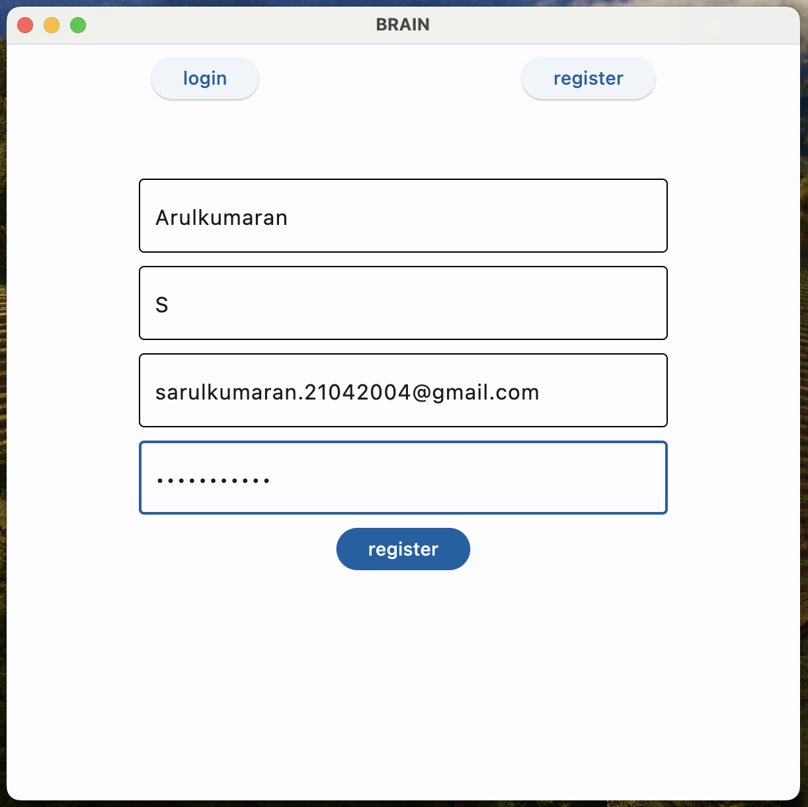
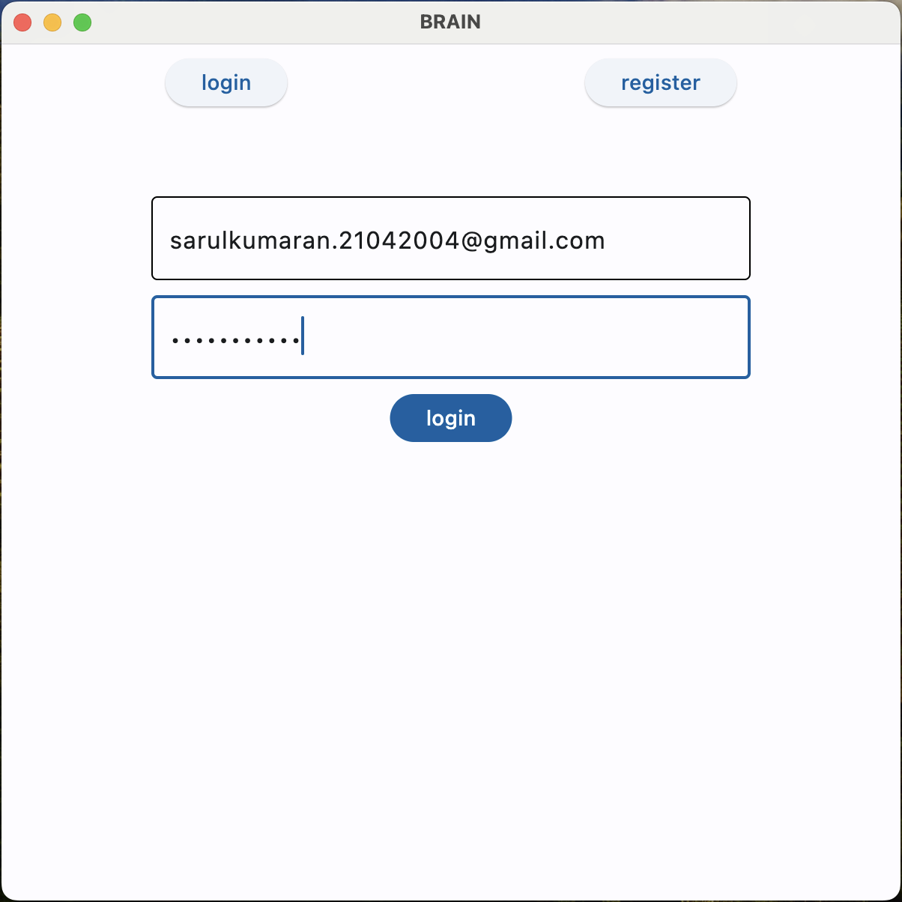
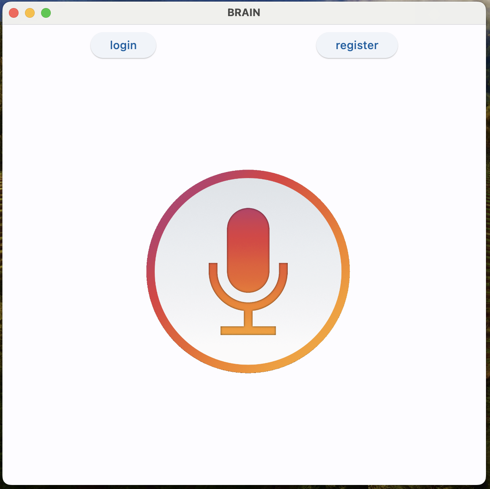

# Black-AI

### Black AI is Partial Personal Assistant for Microsoft windows

# Requirements

<ol>
  <li>Python Environment</li>
  <li>Flet (flutter python)</li>
  <li>MySQL Database</li>
  <li>Neuralintents</li>
  <li>Vosk Audio Recognizer</li>
</ol>

# 1. Python Environment

Anaconda environment is best environment, to do complex Machine Learning Tasks and Fast compared to PyPi Environmet.

you can download anaconda from <a href="https://www.anaconda.com/download">here</a>

# 2. Flet (flutter python)

Flet is a rich User Interface Framework for Python to quickly develop and build Websites, Desktop Applications, and even Mobile Apps.

      
      pip install flet

# 3. MySQL Database

MySQL is a relational database management system used for storing, organizing, and retrieving data in various applications, from web development to enterprise software, offering robustness and scalability for data management needs.

    pip install mysql-connector-python

# 4. Neuralintents 

Neuralintents is a Python package for building AI chatbots quickly, offering easy integration with various platforms and services through intent recognition and response customization, facilitating conversational AI development for diverse applications.

    pip install neuralintents

# 5. Vosk Audio Recognizer

Vosk is an open-source, lightweight, and efficient speech recognition toolkit designed for various applications, offering pre-trained models for recognizing speech in multiple languages and offline speech-to-text capabilities with high accuracy and low latency. It supports integration with Python and other programming languages, making it suitable for both personal and commercial projects requiring speech recognition functionality.

    pip install vosk

you can download vosk model from <a href="https://alphacephei.com/vosk/models/vosk-model-en-us-0.42-gigaspeech.zip">here</a>

# 1. Register 

 
 

# 2. Login

# 3. Ai

